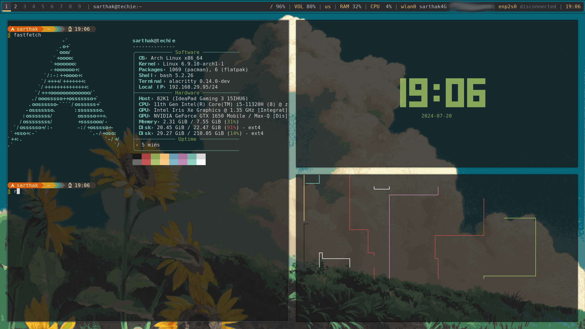

# Awesome
🌟 Welcome to my AwesomeWM rice! 🌟

Hey there! 👋

I'm super excited to share my awesome wm rice with y'all! 🎨✨ As a self-proclaimed noob, there might be a few quirks and errors here and there. 😅 So, please give it a whirl in a VM first to avoid any unexpected surprises! 🖥️🔍

This setup is a labor of love, filled with all the colors and tweaks that make my desktop a joy to use. 🌈💻 I'm still learning and growing, so your feedback and patience are greatly appreciated! 🙌

Dive in, have fun, and happy ricing! 🛠️🎉

Cheers! 🥳🍀

Happy ricing! 🛠️🎉
# Showcase 💫✨


# Updating your system 🔧
```
sudo pacman -Syyu
```

# Installing essentials 💾
```
sudo pacman -S base-devel git libx11 libxft xorg-server xorg-xinit terminus-font wget curl
```
# Installing JetBrainsMono and Awesome Fonts 📝
```
sudo pacman -S ttf-jetbrains-mono-nerd ttf-font-awesome 
```
# Installing alacritty 🐱‍💻
```
sudo pacman -S alacritty
```
```
cp -r $HOME/awesome-wm/alacritty/ $HOME/.config/
```
# Installing FastFetch, pipes.sh and tty-clock 📊
```
sudo pacman -S fastfetch
```
```
cp -r $HOME/awesome-wm/fastfetch/$HOME/.config/
```
```
yay -S pipes.sh
```
```
git clone https://github.com/xorg62/tty-clock.git
cd tty-clock
sudo make install
```

# Installing Neovim ✍️
```
sudo pacman -S neovim
git clone https://github.com/NvChad/starter ~/.config/nvim && nvim
```
For neovim themes do space + t + h
```
gruvbox
```

# Installing SuperFile 📁
```
bash -c "$(wget -qO- https://superfile.netlify.app/install.sh)"
```
change theme = 'gruvbox' ~/.config/superfile/config.toml
```
to run super file type 'spf'
```

# Installing Awesome, picom, polybar and rofi 📥 
```
sudo pacman -S awesome
```

```
cp -r $HOME/awesome-wm/awesome/ ~/.config/
```

```
sudo pacman -S picom
```
```
cp -r $HOME/awesome-wm/picom/ ~/.config/
```
```
sudo pacman -S polybar
```
```
cp -r $HOME/awesome-wm/polybar/ ~/.config/
```

```
sudo pacman -S rofi
```

```
cp -r $HOME/awesome-wm/rofi/ ~/.config/

```
## installation completed ☑️

# installing nitrogen for wallpaper 🖼️
```
sudo pacman -S nitrogen
```
```
cp -r $HOME/awesome-wm/nitrogen/ ~/.config/
```


# installing starship 🚀
```
curl -sS https://starship.rs/install.sh | sh
```
```
For BASH:
echo 'eval "$(starship init bash)"' >> ~/.bashrc
```
```
For ZSH:
echo 'eval "$(starship init zsh)"' >> ~/.zshrc
```
Installing Gruvbox Rainbow Preset 
```
cp -r $HOME/awesome-wm/gruvbox-rainbow.toml $HOME/.config/
cp -r $HOME/awesome-wm/starship.toml $HOME/.config/ 
```
```
starship preset gruvbox-rainbow -o ~/.config/starship.toml
```
# installing vscode </>
```
sudo pacman -S code
```
Theme to install in VScode
```
Gruvbox Material
```
# Basic Shortcuts ⌨

| Shotcut keys  | Funtions      |
| ------------- | ------------- |
| Super + Shift + C     | Quiting apps or Kill |
| Super + Shift + Q  | Killing Awesome  |
| Super + D     | Rofi |
| Super + Shift + Enter  | Terminal (Alacritty)  |

## Installation Script 
The work on the installation script has begun.

## License

This project is licensed under the MIT License.

## Contact

For any questions or feedback, feel free to contact me!

# Congratulation Installation has been Completed! 🥳🎉
